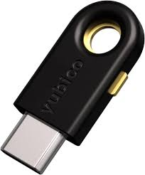
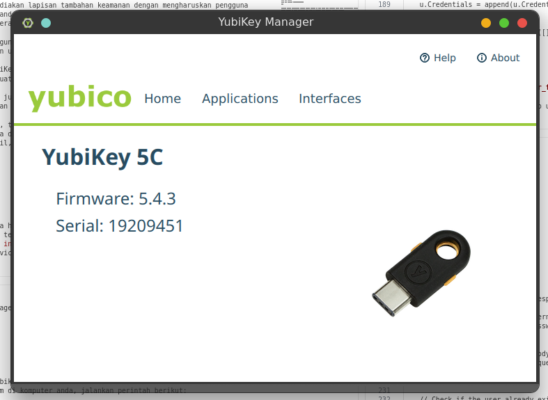
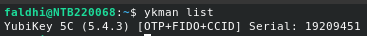
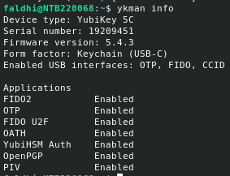
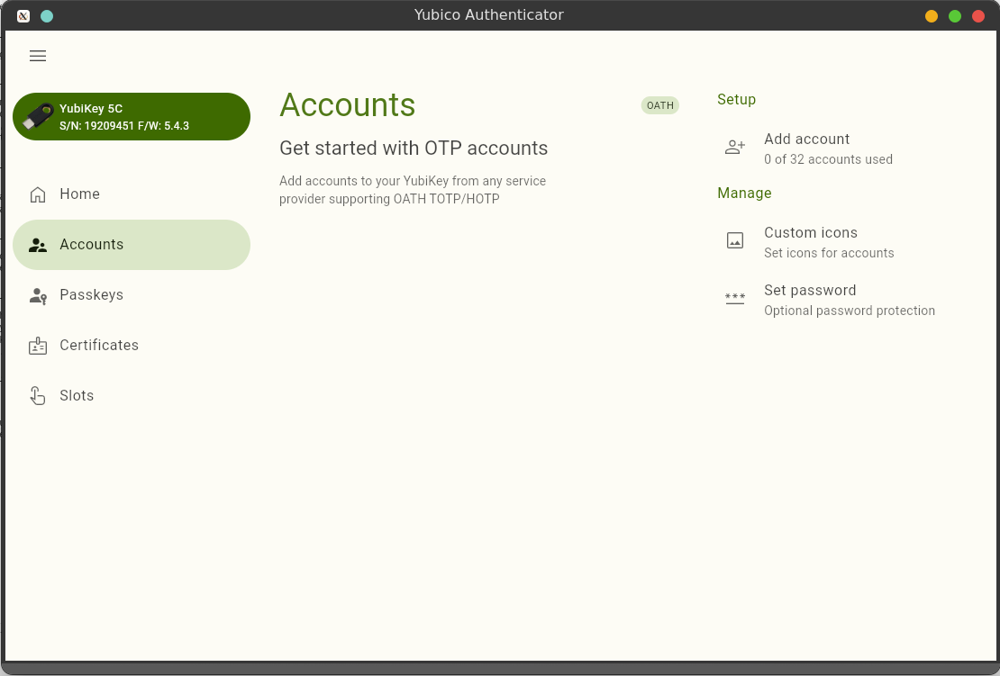

# Pengenalan Yubikey

### Apa itu Yubikey?
YubiKey adalah perangkat keamanan fisik yang digunakan untuk otentikasi dua faktor (2FA) dan pengelolaan kata sandi. Dikembangkan oleh perusahaan Yubico, YubiKey berbentuk seperti USB atau NFC dongle yang dapat dihubungkan ke komputer, smartphone, atau perangkat lain.

#### Fungsi utama YubiKey:

- Otentikasi Dua Faktor (2FA): YubiKey menyediakan lapisan tambahan keamanan dengan mengharuskan pengguna memasukkan perangkat fisik ini selain kata sandi. Ini membuatnya lebih sulit bagi pihak ketiga untuk mengakses akun pengguna karena mereka harus memiliki perangkat fisik YubiKey.

- Otentikasi Berbasis Hardware: YubiKey menggunakan metode enkripsi berbasis hardware untuk memastikan bahwa hanya perangkat tersebut yang dapat digunakan untuk mengotentikasi akses.

- Pengelolaan Kata Sandi: Beberapa model YubiKey dapat digunakan dengan aplikasi pengelola kata sandi untuk menghasilkan dan menyimpan kata sandi yang kuat.

- Tanda Tangan Digital dan Enkripsi: YubiKey juga dapat digunakan untuk menandatangani dan mengenkripsi dokumen, serta untuk otentikasi dalam jaringan perusahaan.

YubiKey mendukung berbagai protokol keamanan, termasuk OTP (One-Time Password), U2F (Universal 2nd Factor), FIDO2, dan Smart Card. Perangkat ini biasanya digunakan dalam skenario di mana keamanan sangat penting, seperti akses ke sistem perusahaan, akun email, atau layanan keuangan.

### Prerequisites
- Device Yubikey 5C
> 

- Yubikey Manager
- Yubikey Authenticator 

### Setup Instruction
Untuk menggunakan Yubikey 5C, sebelumnya anda harus menginstall Yubikey Manager. Pada dokumentasi ini, saya menggunakan OS Ubuntu dalam melakukan config terhadap Yubikey 5C.
Yubikey Manager dapat di download pada [Link ini](https://www.yubico.com/support/download/yubikey-manager/)
Jika sudah terinstall dan sudah memasukan device Yubikey 5C ke port USB-C pada komputer anda, akan muncul GUI seperti berikut:

> 


atau juga anda dapat menggunakan YubiKey Manager CLI yang dapat diinstall dengan menjalankan perintah berikut pada terminal:

```
sudo apt update
sudo apt install yubikey-manager
```

Setelah sukses terinstall, masukan device Yubikey ke port USB-C pada komputer anda. Untuk memverifikasi apakah device Yubikey 5C sudah terkoneksi atau belum di komputer anda, jalankan perintah berikut:

```
ykman list
```
> 

Untuk mengecek informasi lebih detail dari Yubikey anda dapat menjalankan perintah berikut:
```
ykman info
```
> 

Untuk menggunakan fitur OTP pada Yubikey 5C, diperlukan aplikasi tambahan yaitu Yubikey Authenticator yang dapat di unduh pada [Link ini](https://www.yubico.com/products/yubico-authenticator/). Berikut tampilan dari aplikasi Yubikey Authenticator saat Yubikey 5C terkoneksi dengan PC.

> 

### Fitur yang di dukung Yubikey 5C

YubiKey 5C mendukung berbagai fitur keamanan untuk autentikasi multifaktor, keamanan fisik, dan perlindungan data. Berikut adalah beberapa fitur utama yang didukung oleh YubiKey 5C:

1. **Autentikasi Multifaktor (MFA)**

- OTP (One-Time Password): Mendukung protokol OTP untuk autentikasi aman melalui password sekali pakai.
- FIDO U2F (Universal 2nd Factor): Mendukung autentikasi FIDO untuk layanan yang kompatibel dengan U2F, seperti Google, GitHub, dan lain-lain.
- FIDO2/WebAuthn: Mendukung standar WebAuthn untuk autentikasi tanpa password, menggunakan kunci publik dan kunci privat.
- Challenge-Response: Untuk skenario autentikasi berbasis tantangan yang aman.

2. **Autentikasi Passwordless**

- FIDO2/WebAuthn: Selain sebagai faktor kedua, YubiKey 5C juga mendukung autentikasi tanpa kata sandi dengan teknologi FIDO2/WebAuthn untuk login ke layanan tanpa perlu memasukkan kata sandi.

3. **Smart Card / PIV (Personal Identity Verification)**

- YubiKey 5C dapat digunakan sebagai kartu pintar untuk autentikasi berbasis sertifikat (PIV), sering digunakan dalam lingkungan perusahaan untuk akses yang lebih aman ke jaringan dan sistem.

4. **OpenPGP**

- Mendukung OpenPGP untuk kriptografi berbasis kunci publik, yang digunakan untuk menandatangani, mengenkripsi, dan mendekripsi pesan serta dokumen.

5. **Autentikasi TOTP dan HOTP**

- TOTP (Time-Based One-Time Password) dan HOTP (HMAC-Based One-Time Password) dapat digunakan untuk autentikasi berbasis token satu kali, sering digunakan oleh aplikasi autentikasi seperti Google Authenticator.

6. **FIPS (Federal Information Processing Standard) Certification (varian khusus YubiKey 5C FIPS)**

- Sertifikasi ini menunjukkan kepatuhan terhadap standar keamanan yang ditetapkan oleh pemerintah AS untuk penggunaan di lingkungan yang sangat aman.

7. **Autentikasi di Banyak Platform**

- YubiKey 5C mendukung berbagai sistem operasi dan platform, termasuk Windows, macOS, Linux, Android, dan iOS (dengan adaptor atau fitur USB-C).

Dengan fitur-fitur tersebut, YubiKey 5C menawarkan solusi autentikasi kuat yang melindungi dari berbagai ancaman keamanan seperti phishing dan serangan password.


