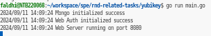
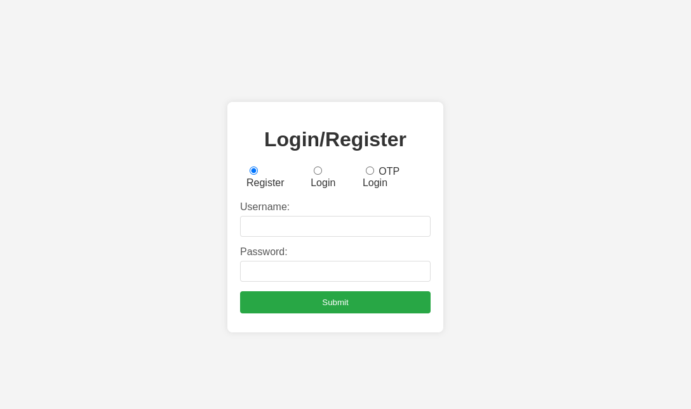
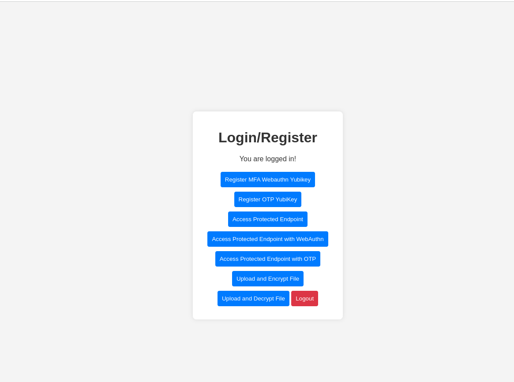
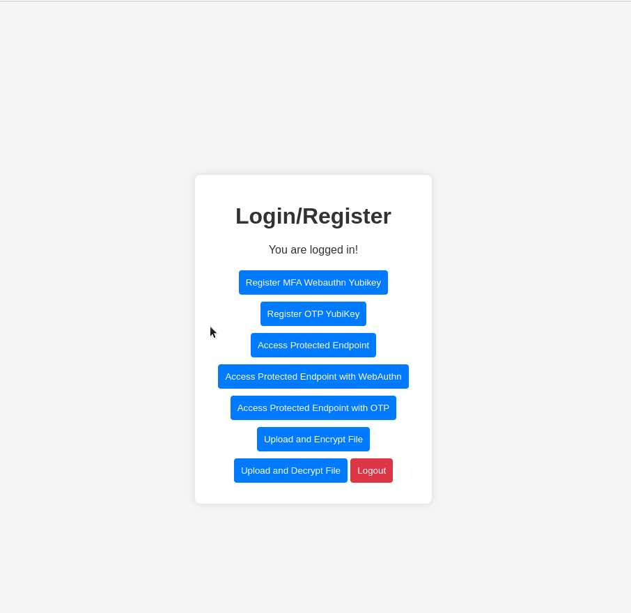
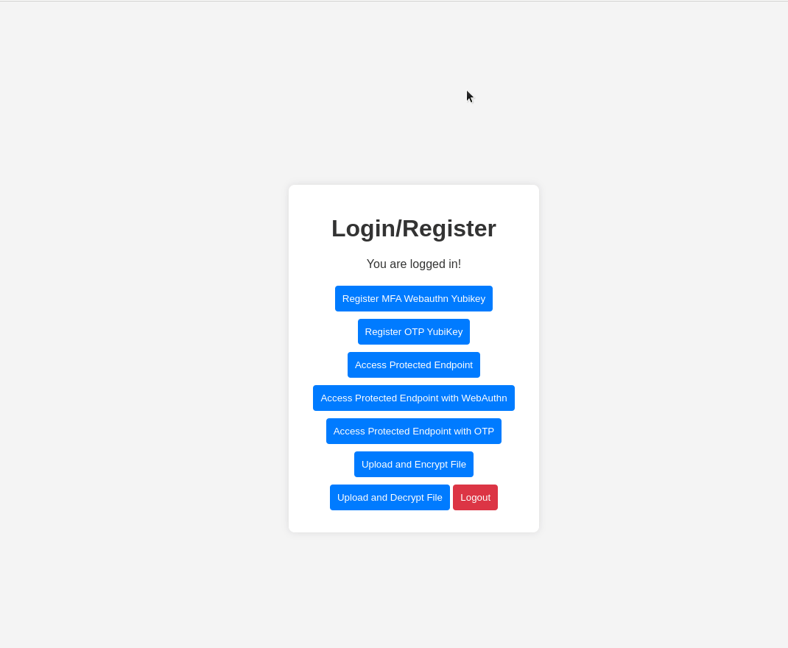

# Testing Access Protected Route With Yubikey (FIDO2 & OTP)

Untuk melakukan testing mengakses route API (endpoint) dengan menggunakan Yubikey, anda dapat menjalankan project sebelumnya dengan menjalankan perintah pada root project.
```
go run main.go
```

Jika project berhasil dijalankan, akan muncul output seperti berikut.

> 

**Note:** Jangan lupa untuk memastikan kredensial dari mongo db sudah benar di file configs/mongo.go.

Lalu bisa membuka http://localhost:8080/ pada browser anda, dapat terlihat website sederhana ada form dengan 3 action yang dapat dipilih dengan radio button.

> 

Lalu login dengan kredensial yang telah dibuat sebelumnya, jika sudah berhasil login maka akan muncul tampilan dibawah ini.

> 

### Testing mengakses protected endpoint dengan metode FIDO2

Untuk melakukan testing, anda hanya perlu menekan button *Access Protected Endpoint with WebAuthn*. Lalu akan ada prompt muncul untuk melakukan 2FA, anda perlu memasukan PIN dan menekan tombol yang ada pada Yubikey seperti saat login.

> 

### Testing mengakses protected endpoint dengan metode OTP

Untuk melakukan testing, anda hanya perlu menekan button *Access Protected Endpoint with OTP*. Lalu akan ada prompt muncul untuk melakukan 2FA, anda perlu memasukan OTP yang digenerate oleh Yubikey Authenticator.

> 


