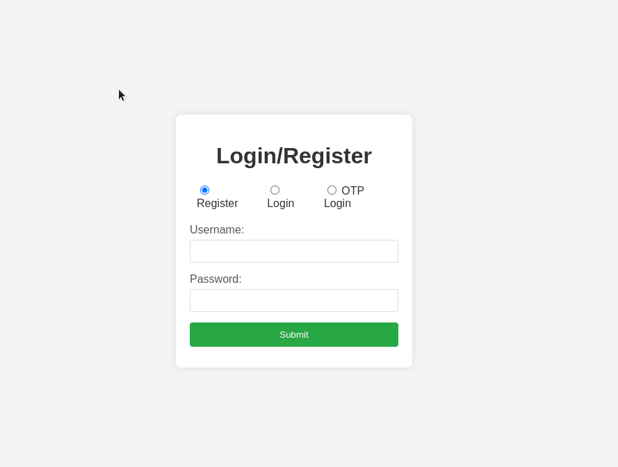
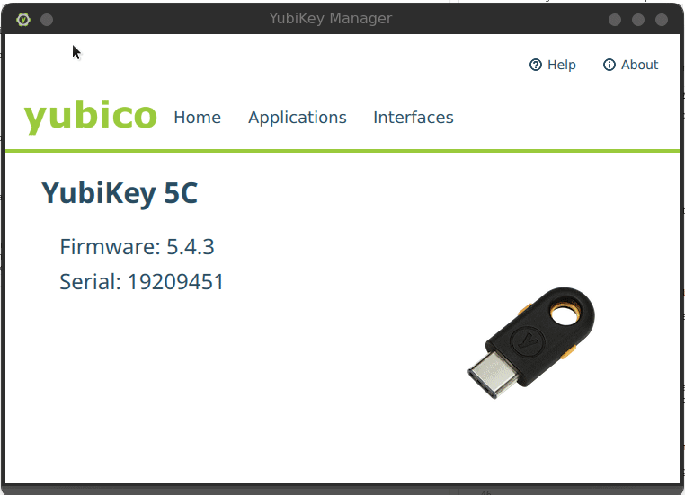
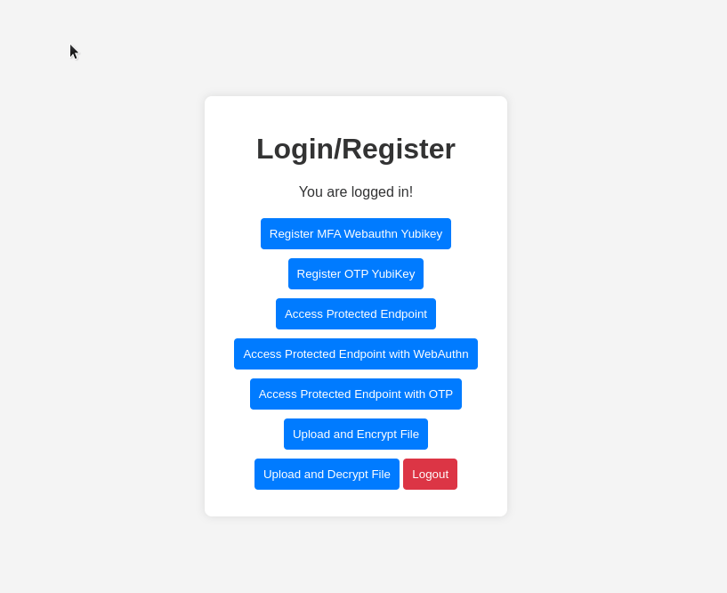
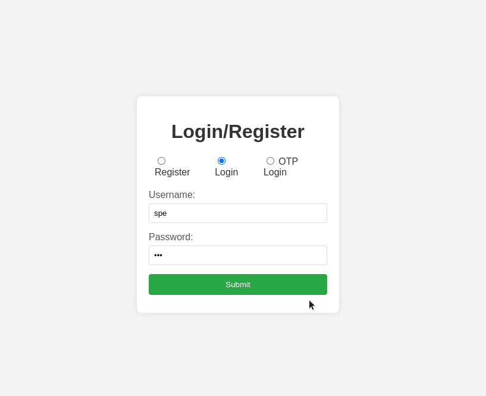
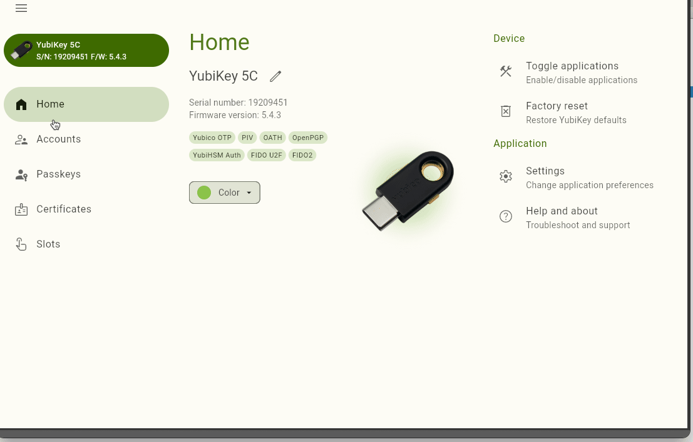
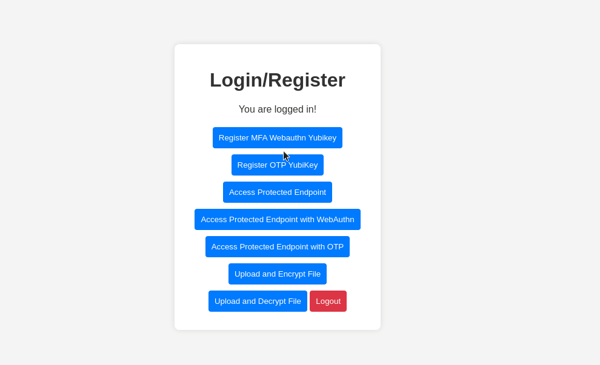

# Testing Register dan Login 2FA Yubikey (FIDO2 & OTP)

Untuk melakukan testing 2FA dengan menggunakan yubikey, anda dapat menjalankan project sebelumnya dengan menjalankan perintah pada root project.
```
go run main.go
```

Jika project berhasil dijalankan, akan muncul output seperti berikut.

> 

**Note:** Jangan lupa untuk memastikan kredensial dari mongo db sudah benar di file configs/mongo.go.

Lalu bisa membuka http://localhost:8080/ pada browser anda, dapat terlihat website sederhana ada form dengan 3 action yang dapat dipilih dengan radio button.

> 

### Testing mendaftarkan 2FA ke account dengan metode FIDO2

Untuk melakukan testing untuk mendaftarkan metode autentikasi 2FA pada sebuah akun, pertama tama akun harus dibuat terlebih dahulu.

> 

Kemudian login dengan menggunakan kredensial yang sebelum nya di register pada sistem.

> 

Ketika login berhasil, terdapat beberapa button dengan berbagai handler ketika di klik. Untuk mengatur agar saat user login selanjutnya menggunakan 2FA, anda dapat menekan tombol "Register MFA Webauthn Yubikey". Namun sebelum itu, anda harus mengatur pin dari Yubikey untuk FIDO2 dengan cara membuka Yubikey Manager dan ke menu FIDO2 seperti di bawah ini.

> 

Setelah pin FIDO2 Yubikey diatur, anda dapat kembali ke browser dan menekan tombol "Register MFA Webauthn Yubikey". Lalu akan ada prompt muncul pada browser anda yang meminta PIN dan perintah untuk menekan tombol kecil yang ada pada Yubikey.

> 

Untuk mencoba apakah akun sudah terdaftar 2FA FIDO2 atau belum, anda dapat mencoba untuk logout dan login kembali dengan kredensial yang di daftarkan 2FA sebelumnya.

> 

Dapat terlihat pada gif diatas, saat login menggunakan user yang didaftarkan 2FA sebelumnya, saat login akan ada prompt yang muncul untuk memasukan PIN dan menyentuh Yubikey untuk login yang membuat akun sudah terikat dengan Yubikey. Apabila Yubikey tidak tercolok saat melakukan login, maka login akan gagal. Dapat dilihat pada gif dibawah.

> 

### Testing mendaftarkan 2FA ke account dengan metode OTP (TOTP)

Untuk melakukan testing untuk mendaftarkan metode autentikasi 2FA pada sebuah akun, pertama tama akun harus dibuat terlebih dahulu atau menggunakan akun yang sebelumnya digunakan untuk testing autentikasi FIDO2. Sebelum dilakukan pengetesan, pastikan bahwa di komputer anda sudah terinstall Yubikey Authenticator sebelumnya karena akan digunakan untuk men-generate OTP yang akan di masukan pada web app.

Langkah pertama dalam pengetesan ini yaitu dengan login terlebih dahulu ke web app, saat sudah berhasil login silahkan tekan tombol "Register OTP Yubikey" yang akan menghasilkan sebuah "Secret Key" yang akan di daftarkan di Yubikey Authenticator.

> 

Lalu buka program Yubikey Authenticator dan paste secret key yang sebelumnya dihasilkan web app.

> 

Untuk mencoba apakah akun sudah terdaftar 2FA TOTP atau belum, anda dapat mencoba untuk logout dan login kembali dengan kredensial yang di daftarkan 2FA sebelumnya dengan menggunakan opsi Login with OTP.

> 
